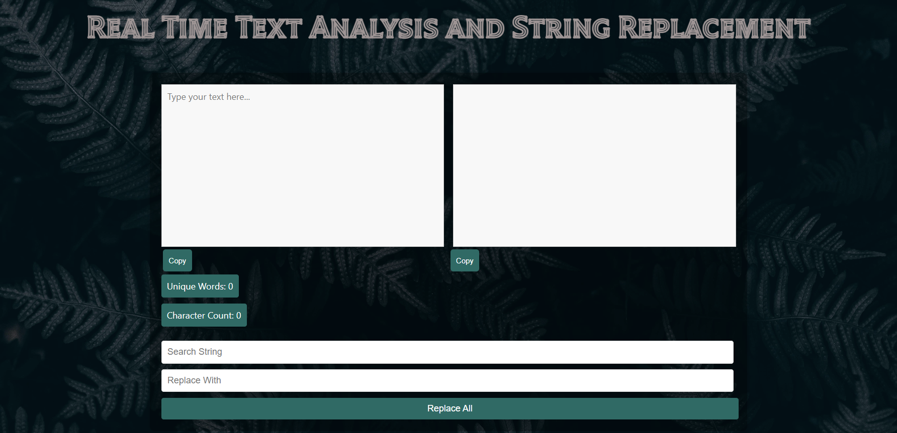

# Real-Time Text Analysis and String Replacement



## Project Overview

This project is a React application designed to perform real-time text analysis and string replacement. The key features include real-time counting of unique words and characters, the ability to search and replace specific strings within the text, and a responsive user interface that enhances user experience.

## Features

1. **Real-Time Text Analysis** :
   - The application analyzes the text input in real-time, providing a count of unique words and characters.
   
2. **String Replacement** :
   - Users can input a search string and a replacement string. The application will replace all instances of the search string with the replacement string.

  
3. **Code Quality** :
   - The project features clean, well-structured, and easily maintainable code to ensure readability and ease of collaboration.

4. **UI/UX Design** :
   - The application provides a clean, user-friendly interface with responsive design, ensuring seamless interaction on various devices.

## Bonus Features
- **Copy Buttons** :
   - Users can copy the original or modified text to the clipboard with a single click.

- **Highlight Replaced Words** :
   - The application will highlight the replaced words in the modified text area for better visualization.


## Technologies Used

- **ReactJS**: For building the user interface.
- **Netlify**: Hosting and continuous deployment.
- **CSS**: For styling and layout.
- **JavaScript**: Used for dynamic content and interactivity.
- **HTML5**: Structuring the webpage.


## How to Run the Project Locally

To run this project locally, follow these steps:

1. **Clone the Repository**:
   ```bash
   git clone https://github.com/singhkrishna01/Real-Time-Text-Analyzer
   
   cd Real-Time-Text-Analyzer
   ```

2. **Install Dependencies**:
   Make sure you have Node.js and npm installed. Then run:
   ```bash
   npm install
   ```

3. **Start the Development Server**:
   ```bash
   npm start
   ```
   The application will be available at `http://localhost:3000`.

## Screenshots

### Initial Interface


### After Replacement


## Highlighting Replaced Words

- **Bonus feature implementation** involves using regular expressions to wrap replaced words with a span for highlighting.
- Example:
  ```js
  const highlightRegex = new RegExp(`\\b${replaceString}\\b`, 'g');
    const highlighted = newText.replace(highlightRegex, `<span class="highlight">${replaceString}</span>`);
    setHighlightedText(highlighted);
  };
  ```

- Adding CSS for the highlight class:
  ```css
  .highlight {
    background-color: yellow;
  }
  ```

## Copy Functionality

- The `copyToClipboard` function is used to copy text content to the clipboard.
- Implemented with buttons for both original and modified text areas.


## Conclusion

This React project showcases the implementation of real-time text analysis and string replacement with a focus on clean code, good UI/UX design, and additional features like Highlighting replaced words and Copy buttons. By following the steps outlined, you can easily run and explore the project locally.


## Contact

For any inquiries, feedback, or support, feel free to reach out to me:

- Email: [krishna00cs@gmail.com](mailto:krishna00cs@gmail.com)
- LinkedIn: [krishnasingh20](https://www.linkedin.com/in/krishnasingh20/)